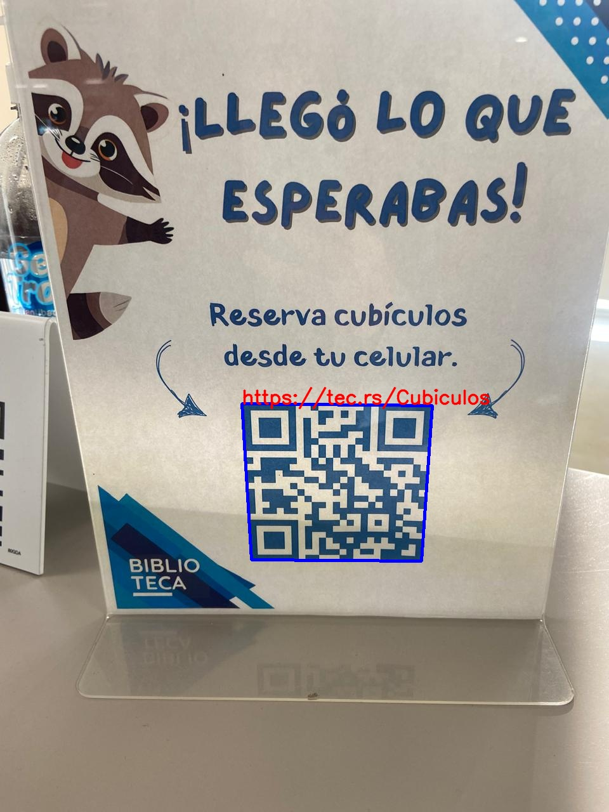

# Lector de QR-s - Semana TEC 1 - Semestre FJ25

## Descripción

Lector de QR-s es un script de Pyton que permite al usuario escanear QR's de dos formas:

- Introduciendo el nombre de una imágen:

    

    - Si existe la imágen se procesará (si es que es un QR) y se podrá ver la imágen modificada con su información en un texto rojo arriba del QR

        - Si existe y se procesa pero no se detectó ningún QR entonces dará aviso de ello

        

        - Caso contrario, si procesa y guarda la info en la imágen original del QR

        

        

- A través de la cámara del dispositivo

    - Abre la cámara y si detecta un QR lo bordea de color verde y en consola imprime la info del QR

        
        

Todo esto a través de una interfaz de consola fácil de entender e interactuar

---

## Consideraciones de uso

Para utilizar el programa es necesario que:

- Instales Python a través del [sitio oficial](https://python.org)

- E instales las siguientes librerias:
    - OpenCV
    - numpy

- Tengas imágenes en el directorio del programa

Solo es esencial que descarges el script de `codigo.py` para ejecutar las acciones del programa pero puedes a parte de los requerimientos, pero puedes clonar el repositorio para probar la ejecución con las imágenes de prueba